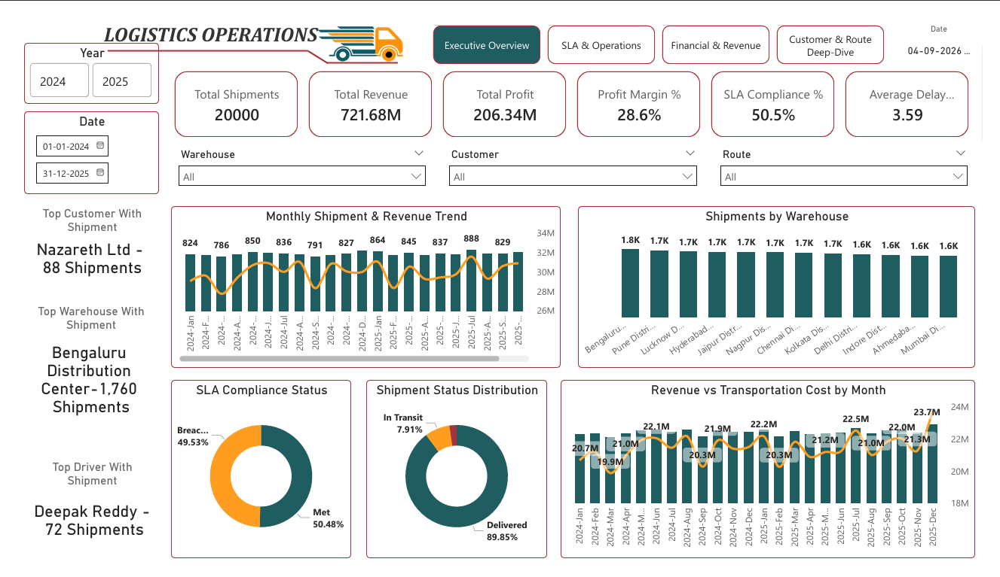
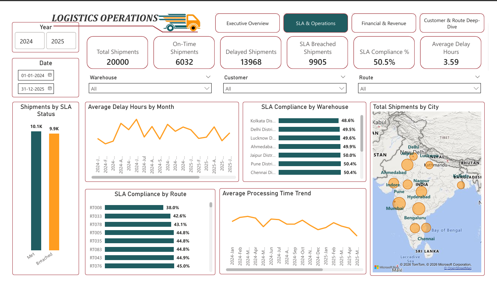
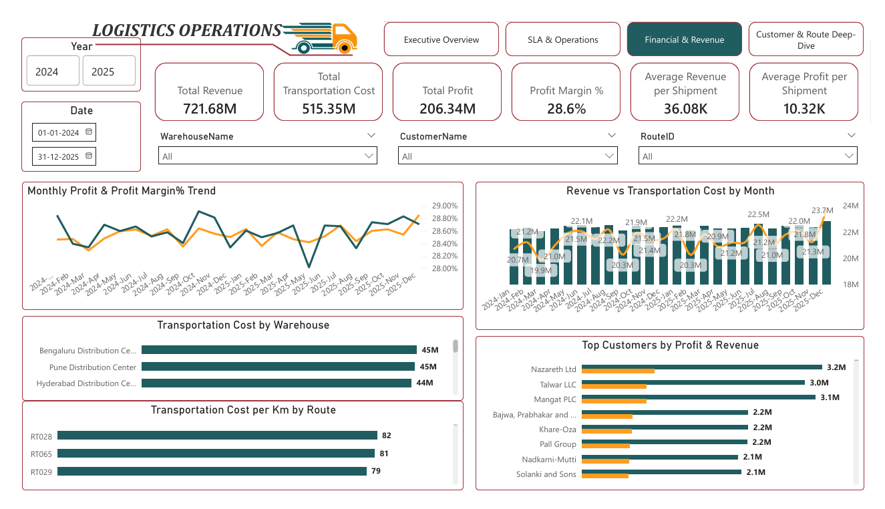
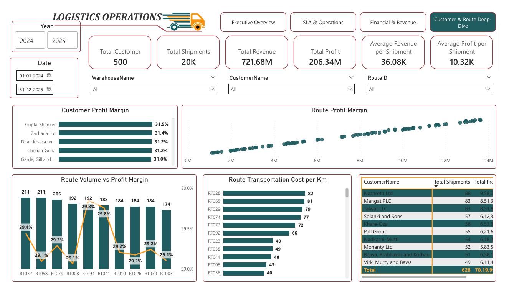

# 🚚 Logistics Operations & Shipment Performance Analytics

## 📊 Project Overview

This project is an end-to-end **Logistics Operations Analytics** solution designed to analyze shipment performance, operational efficiency, SLA compliance, financial performance, warehouse productivity, route performance, customer profitability, and driver/vehicle operations.

The project follows a complete analytics workflow:

**Python → SQL → Power BI**

The solution transforms operational shipment data into actionable business insights through data generation, validation, SQL analysis, data modeling, DAX measures, and an interactive Power BI dashboard.

---
## 🔗 Quick Navigation

- 📊 [Power BI Dashboard](Dashboard/)
- 📁 [Dataset](Dataset/)
- 🗄️ [SQL Analysis](SQL/)
- 🐍 [Python Data Generation & Validation](Python/)
- 📚 [Project Documentation](Documentation/)

## 🎯 Business Problem

Logistics organizations manage large volumes of shipment data across warehouses, customers, routes, vehicles, and drivers.

Without a centralized analytical solution, it becomes difficult to:

- Monitor shipment volumes and delivery performance
- Identify SLA delays and operational bottlenecks
- Compare warehouse performance
- Analyze route efficiency
- Evaluate customer profitability
- Monitor transportation costs and revenue
- Identify driver and vehicle performance issues
- Support data-driven operational decisions

This project addresses these challenges by developing a structured analytics solution that provides both **operational monitoring** and **executive-level business insights**.

---

## 🎯 Project Objectives

The key objectives of this project are:

1. Analyze overall shipment performance
2. Monitor SLA compliance and delivery delays
3. Evaluate warehouse-level operational performance
4. Analyze route efficiency and transportation performance
5. Identify high-value and low-performing customers
6. Evaluate driver and vehicle performance
7. Analyze revenue, transportation cost, and profitability
8. Develop executive-level KPI monitoring
9. Identify operational bottlenecks
10. Provide actionable business recommendations

---

## 🛠️ Tools & Technologies

| Technology | Purpose |
|------------|---------|
| **Python** | Dataset generation, validation and data preparation |
| **SQL Server** | Data storage, transformation, validation and analysis |
| **Power Query** | Data cleaning and transformation |
| **Power BI** | Data modeling, DAX calculations and visualization |
| **DAX** | KPI, financial and time-intelligence calculations |
| **Excel** | Master data and supporting documentation |
| **Git & GitHub** | Version control and project portfolio |

---

## 🏗️ Project Architecture

```text
                    ┌─────────────────────┐
                    │      Python         │
                    │ Data Generation &   │
                    │     Validation      │
                    └──────────┬──────────┘
                               │
                               ▼
                    ┌─────────────────────┐
                    │       Excel         │
                    │ Dimension & Fact    │
                    │       Data          │
                    └──────────┬──────────┘
                               │
                               ▼
                    ┌─────────────────────┐
                    │      SQL Server     │
                    │ Storage, Validation │
                    │   & Analysis        │
                    └──────────┬──────────┘
                               │
                               ▼
                    ┌─────────────────────┐
                    │     Power BI        │
                    │ Data Model + DAX    │
                    │ Dashboard & KPIs    │
                    └──────────┬──────────┘
                               │
                               ▼
                    ┌─────────────────────┐
                    │ Business Insights   │
                    │ & Recommendations   │
                    └─────────────────────┘
```
## 📊 Power BI Dashboard

The interactive Power BI dashboard provides an end-to-end view of logistics operations, shipment performance, SLA compliance, financial performance, customer profitability, warehouse performance and route efficiency.

### Executive Overview

Provides an executive-level summary of shipment volume, revenue, profit, SLA compliance, warehouse performance and operational trends.


---

### SLA & Operations

Analyzes SLA compliance, delayed shipments, average delay hours, warehouse-level SLA performance, route-level SLA performance and processing time trends.



---

### Financial & Revenue

Provides financial analysis covering revenue, transportation cost, total profit, profit margin, monthly financial trends and top customers by profitability.



---

### Customer & Route Deep-Dive

Provides detailed analysis of customer profitability, route profit margins, shipment volume, transportation cost per kilometer and customer-level performance.



Data Model
Fact Table

FactShipment

Contains shipment-level operational and financial information such as:

Shipment ID
Order ID
Customer ID
Warehouse ID
Vehicle ID
Driver ID
Route ID
Dispatch Date
Delivery Date
Shipment Status
Shipment Type
Weight
Distance
Transportation Cost
Revenue
Delay Hours
SLA Status
Processing Time
Dimension Tables
DimCustomer
DimDate
DimDriver
DimRoute
DimVehicle
DimWarehouse

Key KPIs

The Power BI solution includes a range of operational, SLA and financial KPIs.

Operational KPIs
Total Shipments
Total Shipment Quantity
Total Locations
Total Customers
Shipment Status
Average Processing Time
Average Delivery Delay
SLA KPIs
SLA Compliant Shipments
SLA Breach Shipments
SLA Compliance %
Average Delay Hours
On-Time vs Delayed Shipments
Financial KPIs
Total Revenue
Total Transportation Cost
Total Profit
Profit Margin
Average Revenue per Shipment
Average Transportation Cost per Shipment
Efficiency KPIs
Revenue per Kilometer
Cost per Kilometer
Shipment Weight Analysis
Route Performance
Warehouse Efficiency

Dashboard Analysis

The Power BI dashboard provides analysis across multiple operational dimensions.

1. Executive KPI Analysis

Provides a high-level view of:

Shipment volume
Revenue
Cost
Profit
SLA performance
Operational efficiency
2. SLA Performance

Analyzes:

SLA compliance
SLA breaches
Delivery delays
Delay trends
Operational areas requiring improvement
3. Warehouse Performance
Compares warehouses based on:

Shipment volume
Revenue
Cost
Profit
SLA performance

The analysis identified Bengaluru Distribution Center as a significant contributor, accounting for approximately 52.9% of the analyzed shipment performance.

4. Route Analysis

Evaluates routes based on:

Distance
Shipment volume
Transportation cost
Revenue
Profitability
Delivery performance
5. Customer Analysis

Identifies:

High-value customers
Shipment contribution
Revenue contribution
Customer profitability

Nazareth Ltd emerged as the highest-profit customer in the analysis, generating approximately ₹958,020.66 profit across 88 shipments.

6. Driver & Vehicle Analysis

Evaluates:

Driver shipment performance
Vehicle utilization
Shipment allocation
Operational workload
Delivery performance
7. Financial Analysis

Analyzes:

Revenue trends
Transportation costs
Profitability
Profit margins
Cost efficiency

Key Business Insights
The analysis provides several actionable insights:
Shipment performance varies significantly across warehouses.
Warehouse-level concentration can create operational dependency and capacity risks.
SLA performance should be continuously monitored to identify delayed shipments.
Certain customers contribute significantly more to overall profitability.
Route distance and transportation cost have a direct impact on shipment profitability.
Driver and vehicle performance can be used to identify utilization and workload imbalances.
Revenue alone should not be used to evaluate performance; profitability and cost efficiency should also be considered.
Time-based analysis helps identify operational trends and performance changes.

Business Recommendations

Based on the analysis, the following actions are recommended:

1. Improve SLA Performance

Identify recurring delay patterns and focus corrective actions on high-delay routes, warehouses and shipment categories.

2. Optimize Warehouse Operations

Review warehouse capacity, shipment allocation and processing performance, particularly for high-volume locations.

3. Optimize Transportation Routes

Evaluate high-cost and low-profit routes to identify opportunities for route optimization and better vehicle allocation.

4. Strengthen Customer Profitability Management

Prioritize high-profit customers while reviewing low-margin customer and shipment segments.

5. Improve Vehicle Utilization

Monitor vehicle workload and utilization to reduce underutilization and improve transportation efficiency.

6. Monitor Driver Performance

Use driver-level operational KPIs to identify workload imbalances and performance improvement opportunities.

7. Establish Continuous KPI Monitoring

Use the Power BI dashboard as an operational monitoring tool for management decision-making.

Python Component
The Python component is structured into modular components for dataset generation and validation.
Python/
│
├── config/
├── generators/
├── utils/
├── main.py
└── validation.py
The Python workflow supports:

Dataset generation
Master data creation
Fact shipment generation
Data validation
Modular data-processing logic

SQL Component
SQL/
│
├── 01_Database_Setup/
├── 02_Table_Creation/
├── 03_Data_Import/
├── 04_Data_Validation/
├── 05_Analysis_Queries/
└── 06_Views/
The SQL layer supports:

Database setup
Table creation
Data loading
Data validation
Analytical queries
KPI views
Operational analysis

Project Structure
Logistics-Operations-Analytics/
│
├── Dashboard/
│   ├── Logistic_Operations_Dashboard.pbix
│   └── Logistic_Operations_Dashboard.pdf
│
├── Dataset/
│   ├── DimCustomer.xlsx
│   ├── DimDate.xlsx
│   ├── DimDriver.xlsx
│   ├── DimRoute.xlsx
│   ├── DimVehicle.xlsx
│   ├── DimWarehouse.xlsx
│   └── FactShipment.xlsx
│
├── Documentation/
│   ├── Master_Data_Design.xlsx
│   ├── Data_Dictionary.xlsx
│   └── Logistics_Company_Details.docx
│
├── Python/
│   ├── config/
│   ├── generators/
│   ├── utils/
│   ├── main.py
│   └── validation.py
│
├── SQL/
│   ├── 01_Database_Setup/
│   ├── 02_Table_Creation/
│   ├── 03_Data_Import/
│   ├── 04_Data_Validation/
│   ├── 05_Analysis_Queries/
│   └── 06_Views/
│
├── .gitignore
└── README.md

Skills Demonstrated
This project demonstrates practical experience in:

Data Analytics
Operations Analytics
Logistics Analytics
Python
SQL
Power Query
Power BI
DAX
Data Modeling
Star Schema
KPI Development
Time Intelligence
Data Validation
Dashboard Development
Business Intelligence
Business Recommendations
Git & GitHub

Project Outcome

The final solution converts raw logistics shipment data into an interactive analytical platform that enables management to:

Monitor operational KPIs
Track SLA performance
Compare warehouse performance
Analyze route efficiency
Evaluate customer profitability
Monitor drivers and vehicles
Track revenue and costs
Identify operational improvement opportunities
Make data-driven business decisions

Focus Areas: Operations Analytics | Data Analytics | Power BI | SQL | Python